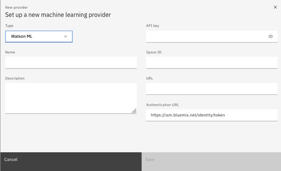

There are a number of steps to complete before the ML model runs within an ADS
decision service. These are the steps :
1. Configuration (4 mins)
2. Integration (13 mins)
3. Combining with rules (9 mins)
4. Using Multiple Models with Guardrails (9 mins)

There are more details for each step below along with links to the accompanying video.
 
## Configuration
To use the Watson ML predictive models in ADS we need to do a bit of configuration to 
connect ADS to the Watson ML Deployment Space we created earlier.

First we need to create a new machine learning provider, here is the configuration screen:

 

We need the following details :
1. An API key
2. The deployment space ID
3. The URL for the Watson ML instance
4. The authentication URL (pre-filled)

Naturally, none of these things are in the same place. The API key is defined at your 
account level. The space ID can be found in the settings tab of the deployment space and the 
URL for Watson ML depends on where your Watson instance lives.

You can watch me perform this configuration on YouTube [here](https://youtu.be/_25IEOPitgM).

Here is the list of [Watson URL's](https://cloud.ibm.com/apidocs/machine-learning#endpoint-url) 
I use in the video.

## Integrating ADS and Watson ML

With ADS configured to use our Watson ML service as an ML provider we can do the integration.

The basic steps are :
1. Generate the mappings between ADS and Watson ML
2. Define ADS data types for ML model input/output
3. Configure the input mapping rules
4. Configure the output mapping rules

There is a walk-through of these steps on YouTube [here](https://youtu.be/go9Y828-1DM).

## Using an ML Model in ADS 
We can now use the model within a decision service. To do this we need to:

1. Define our input parameters
2. Populate the data sent to the model
3. Decide if we'll use the model or a default
4. Output the final result based on the model or a default.

There is a walk-through of these steps on YouTube [here](https://youtu.be/ZNtYuX1POHg).

## Multiple Models and Guardrails
This is the last step, here we can select one of multiple models, either predictive or 
prescriptive, check the parameters are valid, check the confidence from the model is high 
enough to return the prediction.

The video for this is [here](https://youtu.be/GPU9-M7B7Xo).
