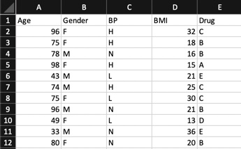

# Drug Data

This is generated data. I generated 100 rows of data at a time using a tool here https://www.generatedata.com

The data looks like this :

There's a few hundred rows of data that contain Age, Gender, Blood Pressure, BMI and Drug. 
This data will be used to train and ML model to predict the value of the Drug column from the other values.

The dataset was designed to have the following subgroups.These are the details that the ML model will try and learn.

 

The group on row 8 are the "noise" group. They have similar characteristics to the group on row 4 that receive Drug C, 
but they are younger (72-75) and they have a slightly lower BMI (25-30). The addition of noise to the data makes 
the ML models a bit less accurate and makes the data more realistic.

Using the data generator I created 100 rows at a time using the characteristics described above. First I setup the tool
to generate the data for Drug A, and called this file A.csv and downloaded this file. Then I repeated the exercise for 
B,C,D,E. Finally, I created noise.csv

Once all the files were downloaded I combined them into a single csv and shuffled it. The output from all this 
is DrugV2Combined.csv which is provided here.   
