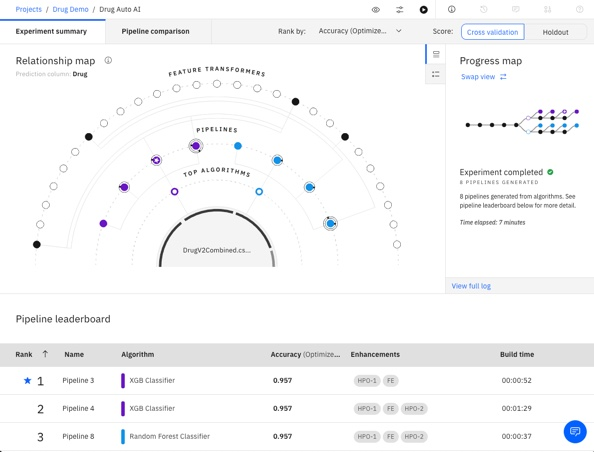

# ML Models

The models used by ADS in the demo were created using Watson Auto AI and deployed to 
Watson ML.

## Example Notebook
There is a notebook here (Drug v2.ipynb) that shows how a decision tree could be trained using Python and Sklearn. 
It contains a visualisation of the decision tree but this model was not used in ADS. 

## Auto AI
The steps to create and run the Auto AI experiment are quite straightforward but I've 
created a short video showing:

1. Creating a Project.
2. Creating an Auto AI experiment
3. Configuring and running the experiment
4. Deploying the ML model
5. Testing the ML model

The video is [here](https://youtu.be/CyC2admff7U) on You Tube and its about 7 mins.

It is assumed you have an IBM Cloud Account and that you've provisioned a Watson Studio and 
Watson ML service, or at least you know how to.

Auto AI was able to encode the categorical data (gender & blood pressure), but if your data
needs more work you might find it easier to do this using a notebook. 

