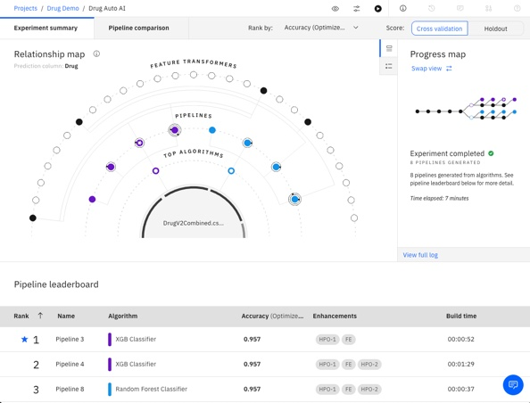

# ML Models

The models used in ADS were created using Watson AutoAI and deployed to WatsonML to make them available for execution.

## Example Notebook
There is a notebook here that shows how a decision tree could be trained using Python and Sklearn. 
It contains a visualisation of the decision tree but this was not used in ADS. 

## AutoAI
It is assumed you have an IBM Cloud Account and that you've provisioned Watson Studio and 
Watson ML sevices, or you know how to.

The steps to create and run the Auto AI experiment are quite straightforward.

I've created a short video showing

1. Creating a Project.
2. Creating an Auto AI experiment
3. Configuring and running the experiment
4. Deploying the ML models

The video is here on You Tube and its about 7 mins.

https://youtu.be/CyC2admff7U

