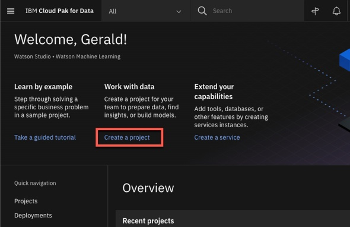

# ML Models

The models used in ADS were created using Watson AutoAI and deployed to WatsonML to make them available for execution.

## Example Notebook
There is a notebook here that shows how a decision tree could be trained using Python and Sklearn. 
It contains a visualisation of the decision tree but this was not used in ADS. 

## AutoAI
It is assumed you have an IBM Cloud Account and that you've provisioned Watson Studio and Watson ML sevices.

_Create Project_

The 

_Create Deployment Space_

_Create Auto AI Experiment_

